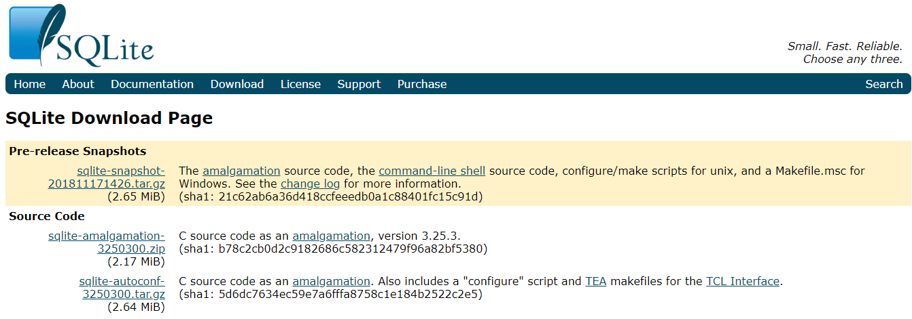
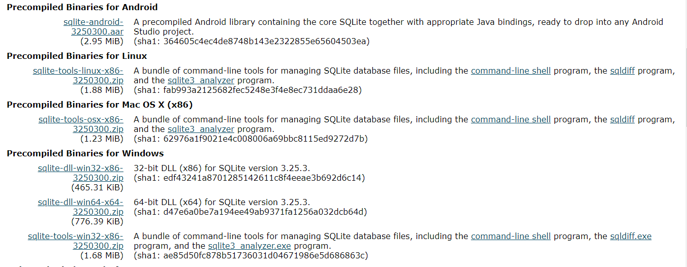
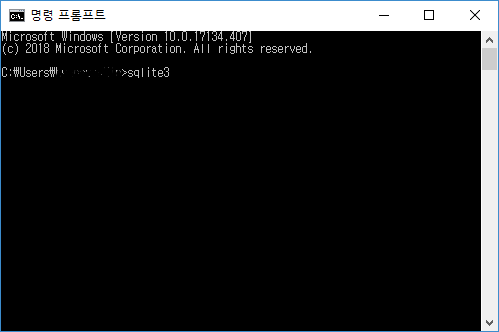
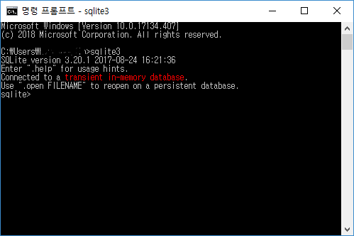

# Da Vinci SW Hackathon (2018)


## 구현환경 (Environments)

- **Python 3.6.7 (Anaconda)**
- **flask**
- **sqlite3**


## Install requirements

```cmd
pip install -r requirments.txt
```


## Install sqlite3

- [**sqlite** 홈페이지](https://www.sqlite.org/download.html) 접속



- 밑으로 내려서 자신의 **OS**에 맞는 파일 다운로드



- 다운로드 받은 파일을 **압축 해제**
- **터미널 (cmd)** 에서 확인



