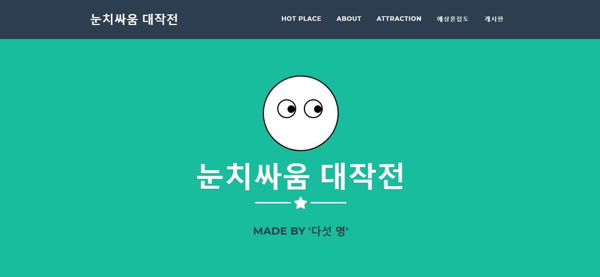
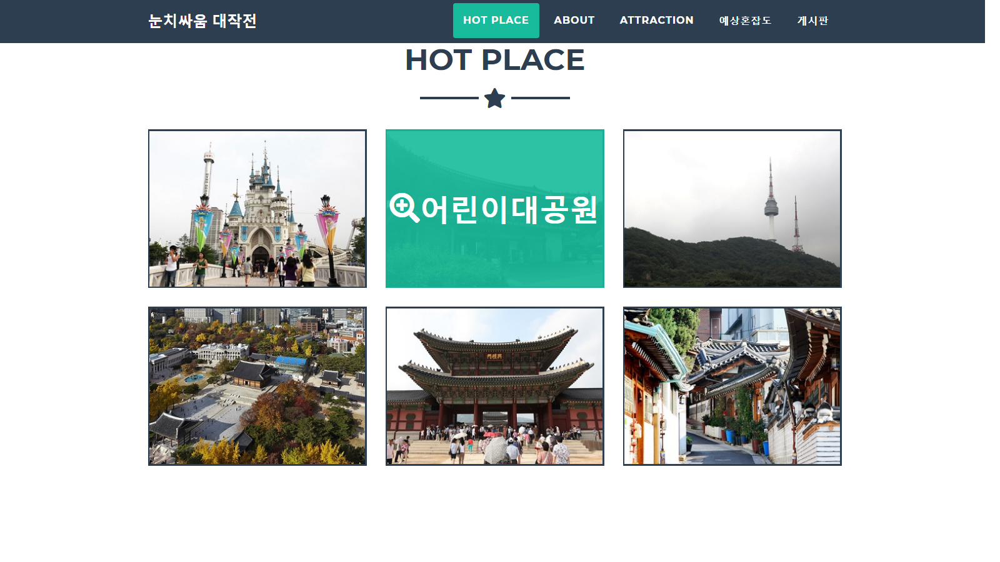
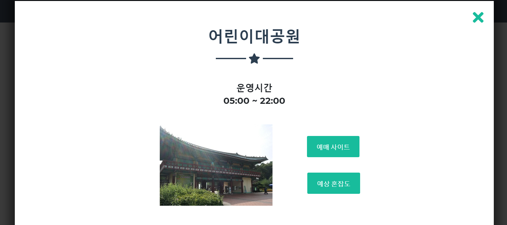
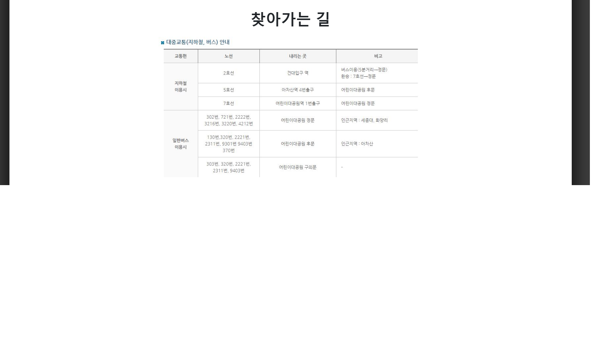
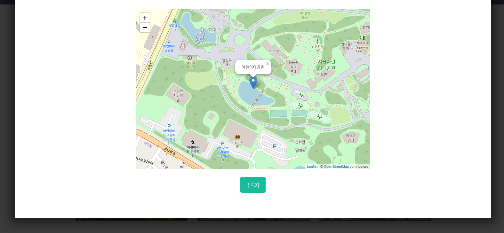
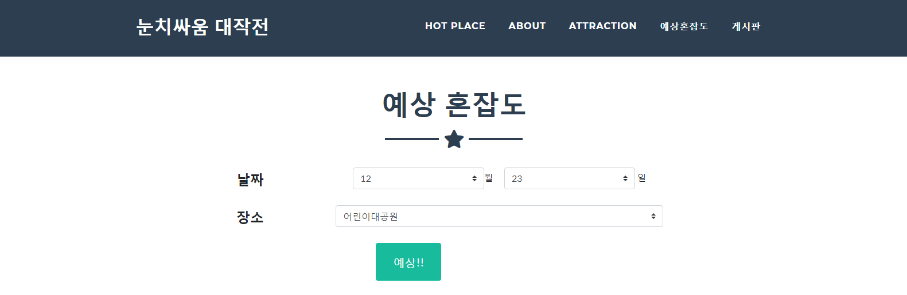
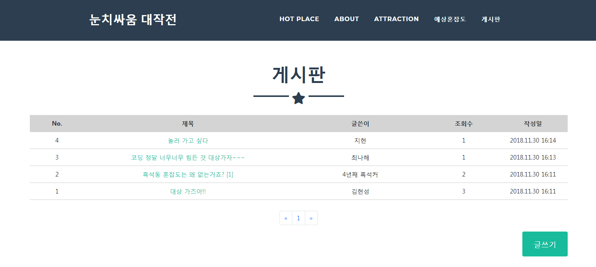
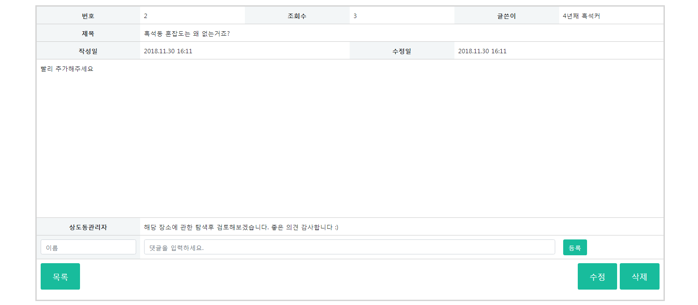

# Da Vinci SW Hackathon (2018)


## 프로젝트명 : 눈치싸움 대작전

**주요 관광지의 혼잡도를 예상해주고 해당 일의 날씨와 위치 정보를 제공해주는 웹 어플리케이션**


### 구현환경 (Environments)

- **Python 3.6.7 (Anaconda)**
- **flask** : 서버를 처리하는 Python framework
- **sqlite3** : DB 구축


### Install requirements

```cmd
pip install -r requirments.txt
```


### Info

- **app.py** : 메인 실행 코드
- **templates/** : html 파일을 모아놓은 폴더
- **static/** : CSS, JS, Image 파일 등을 모아놓은 폴더
- **model/** : LightGBM으로 training한 result 객체 폴더
- **data/** : data를 전처리하는 R code
- **weather_api.py** : T developers의 날씨 API를 이용해 날씨정보를 가져오는 사용자 정의 모듈
- **dataEncoding.py** : LightGBM model로 혼잡도를 예측하기 위한 데이터로 변환시키는 사용자 정의 모듈
- **myapp.db** : sqlite3를 이용해 구축한 DB파일


### 시연
















