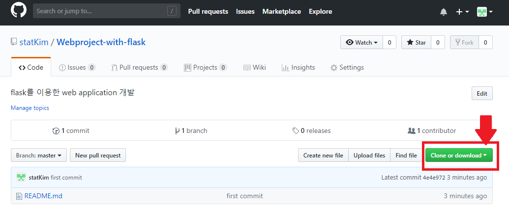

# flask 모듈을 이용하여 간단한 Web Application Service (WAS) 만들기


## 1) flask 모듈이란?

별도의 서버를 구축할 필요 없이 비교적 가볍고 간단히 **web application service**을 구현할 수 있는 모듈(라이브러리)이다.


## 2) 개발환경

- Python 3.6.7 (Anaconda)
- IDE : PyCharm (파이참)   [다운로드](https://www.jetbrains.com/pycharm/download/#section=windows)


## 3) 사용 방법 - Windows10 기준

### 1. 모듈(라이브러리) 설치

- **cmd (명령 프롬프트)** 실행


- **cmd** 에서 **pip** 명령어를 이용하여 **Python 모듈** 설치
  - **한 줄**씩 차례대로 실행하면 됩니다!

  - 실행하다 **error**가 뜨면 error 내용 복사해서 구글링!!

```cmd
# pip 업그레이드(해주면 좋습니다!!)
$ python -m pip install --upgrade pip

# Flask 및 필요 모듈 설치
$ pip install flask
$ pip install requests # 크롤링 할 때 쓰이는 모듈
$ pip install bs4	# 크롤링 할 때 쓰이는 모듈
```

- 잘 설치되었는지 확인하기

```cmd
# cmd 창에서 python 실행하기
$ python

# 파이썬 콘솔처럼 바뀝니다!!
# import 해서 설치 되었는지 확인
>> import flask
>> import requests
>> import bs4
```


### 2. 간단하게 구현해보기

- **flask**는 기본적으로 정해진 형식을 **반드시** 지켜야합니다!!
  - **app.py** : web(쉽게 말하면 인터넷창)으로 구현할 모든 코드가 이 안에 있어야 합니다!!
  - **templates** 폴더 : 우리가 web에 띄울 페이지 파일 (**html**) 들은 모두 이 폴더 안에 있어야 합니다!!
  - **static** 폴더 : html 파일에 적용할 **CSS**, **JS** 등의 파일들은 모두 이 폴더 안에 있어야 합니다!!


- 간단하게 구현해서 되는지 확인해보기
  - **app.py**

```python
from flask import Flask		# flask 모듈 import

app = Flask(__name__)	# flask 객체를 만드는 과정인데 그냥 기본적인 구조라고 생각하면 됩니다.
						# 즉, flask를 이용할 때 항상 있어야 하는 코드입니다.

# app.route() : 페이지(or 주소)가 바뀔 때 어떤 함수를 실행할지 지정하는 것입니다.
# 예를 들면 네이버 스포츠 페이지 ("https://sports.news.naver.com/index.nhn")에서
# "/index.nhn"과 같이 뒷부분을 바꿔주면 페이지가 이동하게 되고 바뀌는 페이지를 지정할 주소를 정해주는 것입니다.
# "/"의 경우는 기본적으로 "root" 페이지라고 하고 실행했을 때 가장 먼저 나오는 페이지입니다.
@app.route("/")	
def hello():		# "/" (root 페이지)에서 실행할 함수 정의 (이것도 flask의 기본 틀입니다.)
    return "hello"	# "/" 페이지에서 "hello"를 출력할 것이다

if __name__ == '__main__':	# 솔직히 이건 없어도 되긴 하는거 같습니다..
    app.run()	# flask 내부의 서버를 켜서 페이지를 열 수 있게 해주는 기능입니다.
    			# "http://127.0.0.1:5000/"을 인터넷 주소창에 입력하면 왼쪽 상단에 "hello"가 출력됩니다.
```

- 실행 결과 화면 (좌측 상단)

  

  > 참고로 본인의 Window 계정명이 **한글**일 경우에는 **'utf-8' decoder error**가 뜨고 실행되지 않습니다.


- **app.py** 의 기본 구조!!

```python
from flask import Flask		# flask 모듈 import

app = Flask(__name__)	# flask를 사용하기 위한 객체를 생성

app.run()	# 서버 실행
```


## 4) 간단한 예시

### 1. Github에서 ZIP 파일로 전체 압축폴더 다운받기

- [Github 접속](https://github.com/statKim/Webproject-with-flask)
- `Clone or download` 버튼 클릭



- `Download ZIP` 버튼 클릭


- PyCharm으로 실행하여 확인


### 2. 그냥 코드 복사해서 사용하기

- app.py

```python
from flask import Flask, render_template

app = Flask(__name__)

@app.route("/")		# 기본 root 페이지
def hello():
    return "hello"
    
# root 페이지인 "http://127.0.0.1:5000/" 뒤에 단어를 입력하면 페이지에 출력됩니다.
# 예를 들어, "http://127.0.0.1:5000/다섯명" => 페이지에 "hello 다섯명" 출력
@app.route("/<name>")
def john(name):
    return "hello {}".format(name)	# "hello %s" % name  과 같은 결과입니다!!
    
# "http://127.0.0.1:5000/show"를 주소창에 입력하면
# "templates" 폴더 안의 "index.html"이 페이지로 출력됩니다.
# 그래서 render_template() 함수는 페이지를 이동시켜서 화면을 바꿀 때 사용합니다.
@app.route("/show")
def show():
    return render_template("index.html")

app.run()
```

- templates 폴더 내에 "index.html" 파일 만들기

```html
<!DOCTYPE html>
<html lang="en">
<head>
    <meta charset="UTF-8">
    <meta name="viewport" content="width=device-width, initial-scale=1.0">
    <meta http-equiv="X-UA-Compatible" content="ie=edge">
    <title>포털 사이트 검색</title>
</head>
<body>
    <h1>Search Naver</h1>
    <form action="https://search.naver.com/search.naver">
        <input type="text" name="query">
        <input type="submit">
    </form>
    
    <h1>Search Daum</h1>
    <form action="https://search.daum.net/search">
        <input type="text" name="q">
        <input type="submit">
    </form>
    
    <h1>Search Google</h1>
    <form action="https://www.google.com/search">
        <input type="text" name="q">
        <input type="submit">
    </form>
</body>
</html>
```


### 3. 결과 확인

- "http://127.0.0.1:5000/"


- "http://127.0.0.1:5000/다섯명"


- "http://127.0.0.1:5000/show"

